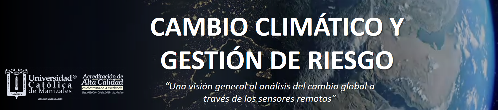

  

# Técnicas y Aplicaciones de Teledetección: Cambio Climático-Riesgos y Desastres

***

## Cambio climático: Análisis de niveles de CO2 en la atmósfera
En este cuaderno vamos a explorar parte del contenido de la **Unidad II. Integración de información para explicar relaciones causa y efecto.** Mediante el ananlisis de los cambios en las temperaturas medias globales, así como el aumento de las concentraciones de CO2 en la atmósfera.

## ¿Como funciona?
1. Puede [descargar](Analysis_of_CO2_levels_in_the_atmosphere.ipynb) el cuaderno de Jupyter Notebook y utilizar los recursos de computación de su PC. 
2. Otra opción alternativa, es el de [**Google Colab**]( https://colab.research.google.com). Como entorno de computación en la nube para cuadernos de Jupyter, la cual aprovecha los recursos técnicos externos, permitiendo que esta herramienta se pueda aplicar en dispositivos con una potencia de computo más limitada, incluidos dispositivos móviles como teléfonos y tabletas, en áreas con escaso ancho de banda. Para ello puede acceder a esta versión directamente haciendo clic en el icono de abajo.

## Acerca de este conjunto de datos
## Contexto 
<left>  
</left> 
El registro de dióxido de carbono del Observatorio Mauna Loa, conocido como la **“Curva de Keeling”**, es el registro ininterrumpido más largo del mundo de concentraciones de dióxido de carbono atmosférico (CO2). Los científicos realizan mediciones atmosféricas en lugares remotos para tomar muestras de aire que es representativo de un gran volumen de la atmósfera terrestre y está relativamente libre de influencias locales.

